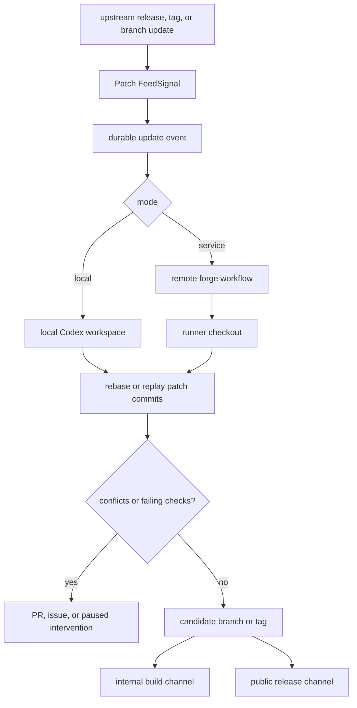

# Architecture

patch.moi has three product responsibilities:

1. Notice upstream movement.
2. Start or resume the right maintenance workflow.
3. Keep enough durable state to inspect, retry, and review what happened.

The Git repository remains the source of truth for the maintained project.
patch.moi does not replace remotes, branches, tags, commits, or release refs
with a separate project file. It reads those facts and records operational state
around them.

## Runtime Pieces

The current service has these runtime pieces:

- The HTTP server exposes health and admin flow endpoints.
- The feed poller reads configured upstream feeds on an interval.
- The JSONL store keeps feed signals, flow events, and dispatch outcomes under
  `DATA_DIR`.
- The flow client can execute locally or dispatch to an HTTP flow backend.

Those pieces are the intake layer. The patch-stack layer can run in local mode
against a checkout, or in service mode through a remote forge workflow and
runner.

The first concrete repo to model against is `../codex`. Its maintained branch is
`code-mode-exec-hooks` in the Peezy fork, and the branch carries Code Mode and
Peezy npm release patches ahead of `origin/main`.

## Maintenance Loop

## Local Mode

In local mode, patch.moi can run inside or next to the maintained repository.
The repository itself describes the project:

- `upstream` or another configured remote points at the source project.
- `origin` or another fork remote points at the maintained fork.
- branch names identify the maintained patch stack and candidate refs.
- tags identify upstream release points and downstream release candidates.

No `.patchmoi` file is required for that topology.

## Service Mode

In service mode, the forge is the coordination surface. For Codex maintenance,
patch.moi should interact with the remote fork host:

- create or update remote maintenance branches
- trigger forge workflows or runners
- open or update pull requests, issues, comments, checks, and artifacts
- record workflow run ids, branch names, and review links

The runner checkout is disposable. The durable project state is the remote fork,
its refs, and the forge records around the maintenance attempt.

For the Codex fork, service mode should be able to target a remote fork, fetch
OpenAI upstream refs in a runner, rebase `code-mode-exec-hooks`, and push a
candidate branch or `rust-v*` tag when policy allows.

See [Forge service mode](forge-service-mode).

## Boundaries

patch.moi owns update intake and maintenance orchestration. Local workspaces or
forge runners own the actual patch application work. Release channels own
deployment and publishing decisions.
