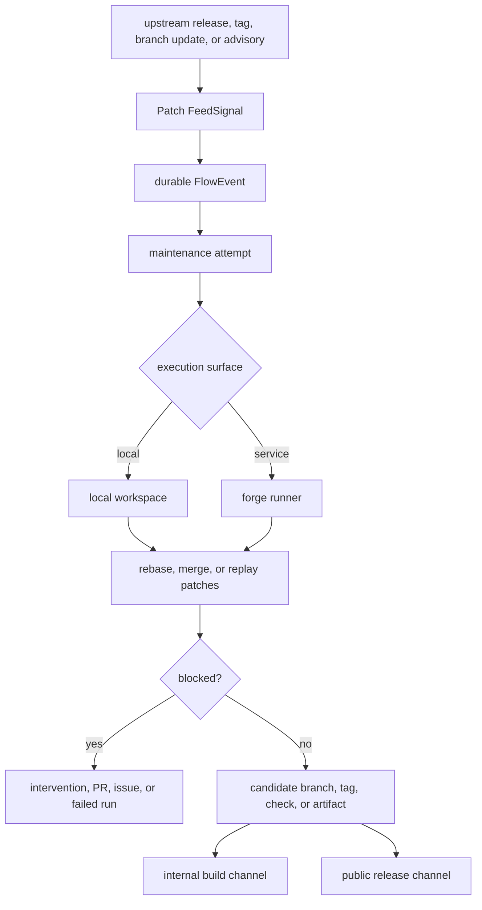

# Architecture

patch.moi is a maintenance control plane, not a replacement for the maintained
repository. Its architecture follows one rule: Git and the forge hold patch
truth; patch.moi holds operational truth.

## Product Loop

patch.moi has three product responsibilities:

1. Notice upstream movement.
2. Start or resume the right maintenance workflow.
3. Keep durable state for inspection, retry, replay, and review.

## Runtime Pieces

The current service has these pieces:

| Piece | Role |
| --- | --- |
| HTTP server | health, admin listing, retry, replay, sync, and workspace inspection endpoints |
| feed poller | reads configured upstream feeds and emits normalized signals |
| JSONL store | writes feed events, flow events, workspace dispatches, and maintenance attempts under `DATA_DIR` |
| workspace backend adapter | dispatches locally when no backend URL is set, or calls a configured Codex workspace backend |
| harness flow | exercises real fork maintenance through `flows/patch-moi-harness` |
| repo workspace config | exposes manual operator tasks through `codex-flows workspace doctor|tick|run` |

Those pieces are intentionally narrow. The service coordinates and records; the
workspace or runner performs the patch application work.

## State Boundaries

patch.moi-owned state lives under `DATA_DIR`:

- feed cursors and feed events
- deterministic flow events
- workspace dispatch, retry, and replay records
- maintenance attempts, outcomes, candidate refs, and intervention state

Codex workspace state lives under `.codex/workspace/<mode>` and describes the
operator automation surface. Local workspace state is ignored. Actions state is
reserved for future CI or service use where committing selected state may be
intentional.

Neither store contains the patch stack. Patch commits, branches, tags, and
candidate refs remain in Git and the forge.

## Local Mode

Local mode is checkout-oriented. The operator has a real repository nearby,
with remotes and branches that describe the project:

- `upstream` or another configured remote points at the source project
- `origin` or another fork remote points at the maintained fork
- branch names identify the patch stack and candidate refs
- tags identify upstream release points and downstream release candidates

No `.patchmoi` project file is required. Repo-native files such as
`package.json`, `flow.toml`, CI workflows, and `.codex/workspace.toml` can
describe automation, but Git still describes the patch stack.

## Service Mode

Service mode is forge-oriented. patch.moi should interact with the remote fork
host:

- create or update maintenance branches
- trigger forge workflows or runners
- open or update pull requests, issues, checks, comments, and artifacts
- record workflow run ids, branch names, outcomes, and review links

Runner checkouts are disposable. Durable project state is the remote fork, its
refs, and forge records around the maintenance attempt.

See [Forge service mode](forge-service-mode) for the service shape.

## Boundary Rule

Use flow events for portable automation triggers. Use patch.moi state for the
product lifecycle around those triggers: feed history, dispatch attempts,
workspace run ids, candidate refs, review status, and intervention state.

See [Flow boundary](flow-boundary) for the layer-by-layer contract.
