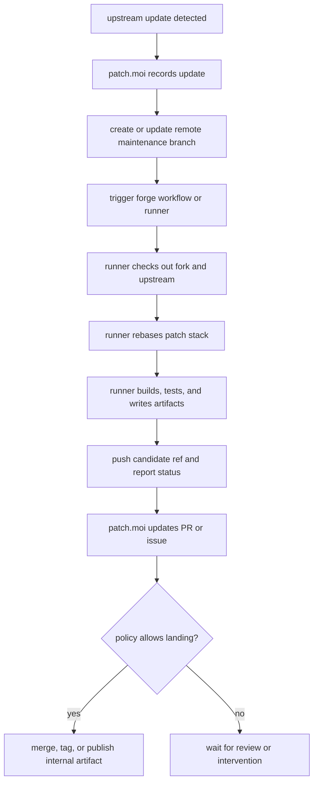

# Forge Service Mode

Service mode should be forge-oriented. patch.moi should interact with the
remote Git host for the maintained Codex fork and let that forge hold the
durable coordination surface.

In this mode, patch.moi is not a daemon babysitting one long-lived local clone.
It watches upstream, updates remote refs, opens or updates review surfaces,
triggers workflow runners, and records enough state to inspect what happened.

## Remote Surface

A forge-oriented service can use these remote objects as the product surface:

| Remote object | Purpose |
| --- | --- |
| fork repository | durable maintained project |
| upstream mirror or remote metadata | source of upstream refs and tags |
| patch branch | maintained patch stack |
| maintenance branch | candidate branch for one upstream update |
| pull request or issue | review and operator discussion |
| workflow run | disposable execution workspace |
| artifacts | internal build output and logs |
| checks or statuses | policy gate for landing or publishing |

Git refs and forge records are durable. Runner workspaces are temporary.

## Service Flow

## Codex Fork Shape

For Codex maintenance, patch.moi should treat the remote fork as the service
backend:

- keep `peezy-tech/codex` as the maintained fork repository
- create patch and maintenance branches in that repository
- trigger GitHub Actions or another registered runner
- let the runner create or update patch commits
- publish internal artifacts from runner output when policy allows
- use PRs, issues, comments, checks, and artifacts as the operator surface

The service can still keep its own feed cursor and run index, but the important
project state should be recoverable from the remote forge.

## Difference From Local Mode

Local mode is checkout-oriented. The operator is near the repo and can run,
build, link, inspect, and fix directly.

Service mode is remote-oriented. patch.moi talks to the forge, and the forge
runner creates disposable checkouts to do the work. This keeps service
automation closer to how releases, review, CI, and artifacts already work.

## Codex Runner Role

Codex can participate inside the runner:

- resolve or rebase patch conflicts
- update package metadata
- run project-specific verification
- leave structured failure context for review
- push a candidate branch when allowed

That Codex execution is part of the workflow job. It does not need to be a
long-lived workspace owned by the patch.moi service process.
