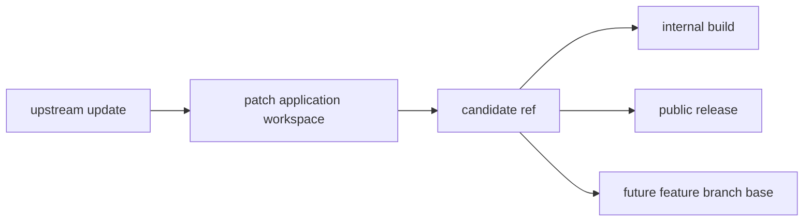

# Workspaces And Channels

patch.moi has to keep several concepts separate. They often touch the same Git
repository, but they should not collapse into one process.

## Update Feed

The update feed watches upstream. It answers one question:

> Did upstream move in a way we care about?

That can be a release tag, a branch update, a security advisory, or another
source signal. The feed should create durable update records and then stop. It
does not decide how to deploy or publish the maintained fork.

## Patch Application Workspace

A patch application workspace is the disposable place where a specific upstream
point is carried forward into the maintained patch stack. In local mode, that
can be a checkout run directly or through Codex workspace tooling. In service
mode, it should usually be a forge runner checkout.

Typical work:

- fetch upstream and fork remotes
- resolve the upstream target tag or commit
- rebase, merge, or cherry-pick the patch stack
- stop on conflicts with useful context
- run verification commands
- produce a candidate branch or tag

The workspace may be local or runner-managed. The patch stack itself still lives
in Git. Repo-native `codex-flows workspace` tasks are operator automation for
running known commands; they are not a separate patch-stack database.

In the current Codex fork, this means rebuilding `main` from a canonical
OpenAI Codex release tag or `upstream/main` plus the ordered local `patch/*`
branches.

## Feature Development Workspace

A feature development workspace creates new patch commits. It is not the same as
the maintenance workspace or runner job.

Feature work can start from the current maintained branch, produce commits, and
push them to a patch branch or pull request. Once merged into the maintained
patch stack, those commits become part of future maintenance runs.

Keeping feature development separate prevents a new feature from being confused
with the automated task of carrying existing patches onto a new upstream point.

## Internal Build Channel

The internal channel is for immediate use by the operator. For example:

- a local Codex fork can build and link the native binary through the npm wrapper
- a runner can publish internal Codex artifacts from a maintenance branch
- internal containers or binaries may be produced before public release

This channel can track upstream main, a release candidate branch, or any other
operator-chosen ref. It should not be blocked by public release mechanics unless
the operator wants that coupling.

For the Codex fork, the internal channel should build the local native binary,
stage it into the npm wrapper/vendor layout, and link that package with Bun.
That tests the same JavaScript launcher and binary handoff users get from npm
without waiting for the full multiplatform CI release.

In service mode, the same idea should happen through a forge runner artifact:
the runner builds the binary, stages the wrapper shape, and publishes an
internal artifact or package without invoking the whole public release workflow.

## Public Release Channel

The public release channel is for artifacts other people consume. It usually has
stricter rules:

- follow upstream release tags
- run reproducible CI checks
- publish from the public repository
- use GitHub Actions or another trusted publishing path for npm
- keep release notes and versioning stable

Public release can take longer than internal use. A clean architecture lets
internal builds move while public release waits for review, CI, or upstream
release cadence.

For the Codex fork, public release is the `rust-v*` tag path in GitHub Actions
that publishes the `@peezy.tech/*` npm packages. That path should remain
separate from local use of the fork.

## Why This Split Matters

The same upstream signal may fan out to multiple outcomes:

patch.moi should record the relationship between those outcomes without forcing
one channel to depend on another.

See [Flow boundary](flow-boundary) for how feed events, workspace runs, and
patch attempts stay separate.
