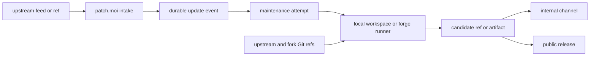

# patch.moi

patch.moi watches upstream projects and keeps the operational record for
maintained forks. It does not replace Git, CI, or release tooling. It records
what upstream did, starts or resumes the right maintenance work, and preserves
enough state to inspect, retry, replay, and review the result.

The patch stack remains ordinary Git:

- upstream movement comes from feeds, remotes, tags, branches, and commits
- maintained forks live in fork repositories and patch branches
- patch commits stay in the maintained repository
- candidate outputs are branches, tags, pull requests, checks, or artifacts
- internal build and public release channels consume candidate refs separately



## Ownership

patch.moi owns product state around the patch stack:

- feed cursors and normalized update signals
- deterministic flow events
- workspace dispatch, retry, and replay records
- maintenance attempts, candidate refs, outcomes, and intervention state
- admin inspection APIs for that state

Execution surfaces own the work itself:

- codex-flow packages match events and run portable Bun or Code Mode steps
- Codex workspace backends provide app-server, delegation, and flow transport
- local workspaces and forge runners fetch, rebase, verify, and push candidates
- release channels publish or deploy after review and policy gates

`.codex/workspace.toml` is repo-native operator automation. In this repo it
exposes the harness fixture through `codex-flows workspace doctor|tick|run`.
That state lives under `.codex/workspace/<mode>` and does not replace
patch.moi-owned `DATA_DIR` records.

## Fastest Path

Install and run the checks:

```bash
bun install
bun run check
```

Run the harness directly:

```bash
CODEX_FLOW_FETCH=0 CODEX_FLOW_PUSH=0 bun run harness:flow
```

Run the same harness through the patch.moi CLI and record `DATA_DIR` state:

```bash
CODEX_FLOW_FETCH=0 CODEX_FLOW_PUSH=0 bun run patch.moi -- run harness
bun run patch.moi -- status
```

Run the same harness through repo-native workspace autonomy:

```bash
bun run workspace:doctor
CODEX_FLOW_FETCH=0 CODEX_FLOW_PUSH=0 bun run workspace:run:harness
```

Run the manual workspace-owned flow smoke task only when a Codex workspace
backend is running:

```bash
CODEX_WORKSPACE_BACKEND_WS_URL=ws://127.0.0.1:3586 \
CODEX_FLOW_FETCH=0 CODEX_FLOW_PUSH=0 \
bun run workspace:run:harness-flow
```

Start the Patch service when you want feed intake and admin state:

```bash
DATA_DIR=./data FEED_SOURCES_PATH=/path/to/workspace/feed-sources.json bun run --filter @peezy.tech/patch dev
```

## Codex App Plugin

This checkout is also a local Codex plugin marketplace. Install dependencies
first so Codex can start the bundled MCP server:

```bash
bun install
```

In Codex App, open Plugins, choose Add marketplace, enter the checkout root, for
example `/home/peezy/meta-workspace/patch.moi`, then install `patch-moi` from
the `patch-moi-local` marketplace. Reload Codex App, or start a new thread, so
the plugin skills and MCP server are loaded.

The same install can be done from a Codex CLI that shares the same `CODEX_HOME`:

```bash
codex plugin marketplace add /home/peezy/meta-workspace/patch.moi
codex plugin add patch-moi@patch-moi-local
```

## Read Next

- First harness run: [Run the harness maintenance flow](tutorials/run-harness-maintenance-flow).
- Feed intake: [Watch an upstream release](tutorials/watch-upstream-release).
- Operator runbook: [Maintain a fork](guides/maintain-a-fork).
- CLI operations: [CLI](reference/cli).
- System model: [Architecture](concepts/architecture).
- Durable state: [JSONL state](reference/jsonl-state).
- Retry and replay: [Flow event retry and replay](reference/dispatch-and-replay-flow-events).
- Codex-specific model: [Codex fork model](concepts/codex-fork-model).
- Service runner shape: [Forge service mode](concepts/forge-service-mode).

## Repository Layout

- `apps/patch`: Patch service, feed poller, JSONL store, admin API, Discord
  output, and workspace backend adapter.
- `flows/patch-moi-harness-*`: source harness flows that mirror the Codex
  fork release, main-update, and downstream-release surfaces.
- `.codex/workspace.toml`: optional repo-native harness automation config.
  Real installed maintenance flows belong in the workspace repo that uses
  patch.moi, not in this product repo.
- `harness`: upstream and maintained fork repositories used for rehearsal.
- `docs`: this Tome documentation site.
