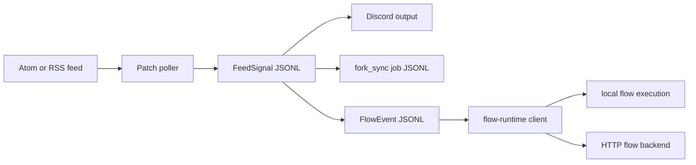

# patch.moi

Patch is a small Bun service that watches upstream Atom/RSS feeds and turns
selected upstream activity into durable Patch records, Discord notifications,
or generic codex-flow events.

The service keeps the product boundary narrow:

- Feeds describe upstream repositories and events.
- Patch normalizes feed entries into `FeedSignal` records.
- Targets decide whether a signal is notification-only, a legacy fork-sync job,
  or a generic flow dispatch.
- Flow dispatch uses `@peezy.tech/flow-runtime/client` so Patch can run flows
  locally during development or send events to an HTTP backend in service mode.
- Admin endpoints inspect stored flow events and dispatch records, then retry or
  replay events when an upstream automation needs another attempt.

## Start here

- New service setup: [Watch an upstream release](tutorials/watch-upstream-release).
- Codex release automation: [Dispatch a Codex release flow](tutorials/dispatch-codex-release-flow).
- Running the service: [Run Patch locally](guides/run-patch-locally).
- Exact feed shape: [Feed sources](reference/feed-sources).
- Admin operations: [HTTP API](reference/http-api).

## What is in this repo

- `apps/patch`: the Patch Bun service, feed poller, JSONL store, Discord output,
  and flow dispatch adapter.
- `docs`: this Tome documentation site, organized with the Diataxis framework.
- `Dockerfile`: container image for the Patch service app.
