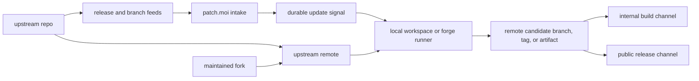

# patch.moi

patch.moi keeps custom features alive on top of upstream open source projects.
It watches upstream movement, records durable update signals, and hands the
actual patch work to local workspaces or remote forge runners that operate on
normal Git repositories.

The product boundary is Git-first:

- Upstream projects stay upstream remotes, tags, branches, and release feeds.
- Maintained forks stay fork remotes and patch branches.
- Patch stacks are commits, branches, and tags, not a second Patch-specific
  project file.
- patch.moi records observations, maintenance attempts, workspace run ids, and
  review state around those Git facts.
- Local Codex workspaces or forge runners do the maintenance work: rebase patch
  commits, resolve conflicts, build candidates, and leave human intervention
  points when needed.

## Start here

- New service setup: [Watch an upstream release](tutorials/watch-upstream-release).
- Codex patch-stack automation: [Dispatch a Codex release flow](tutorials/dispatch-codex-release-flow).
- Running the service: [Run Patch locally](guides/run-patch-locally).
- Git model: [Git source of truth](concepts/git-source-of-truth).
- Concrete Codex model: [Codex fork model](concepts/codex-fork-model).
- Service mode: [Forge service mode](concepts/forge-service-mode).
- Release channels: [Workspaces and channels](concepts/workspaces-and-channels).
- Exact feed shape: [Feed sources](reference/feed-sources).
- Admin operations: [HTTP API](reference/http-api).

## What is in this repo

- `apps/patch`: the Patch Bun service, feed poller, JSONL store, and workspace
  backend adapter.
- `docs`: this Tome documentation site, organized with the Diataxis framework.
- `Dockerfile`: container image for the Patch service app.

The current service implements upstream intake and dispatch. Patch-stack
maintenance is performed by the local workspace, forge runner, or codex-flow
package that receives the event.
