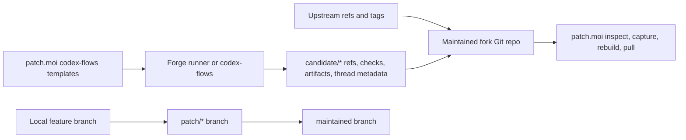

# patch.moi

patch.moi is local Git porcelain for patch-stack work on maintained forks.

It helps you inspect remotes, inspect ordered `patch/*` branches, start or point
at feature branches, capture feature work into patch branches, rebuild the
maintained branch, and pick up runner-produced candidate refs from Git.

It ships codex-flows automation templates as reusable recipes, but it does not
own runner orchestration, retry/replay, run history, remote/mobile control,
thread transplant, feed cursors, or an HTTP admin service. Those belong to
codex-flows, the forge, and Git.

## Model



## Common commands

```bash
bun run patch.moi -- patch doctor --repo harness/fork
bun run patch.moi -- work start feature --title "My feature" --repo harness/fork --branch feature/my-feature --base main --create-branch
bun run patch.moi -- patch capture patch/010-my-feature --repo harness/fork --from feature/my-feature --base main
bun run patch.moi -- patch rebuild --repo harness/fork --to main
bun run patch.moi -- patch candidates --repo harness/fork --remote origin
PATCH_MOI_ALLOW_PULL=1 bun run patch.moi -- patch pull --repo harness/fork --remote origin --branch candidate/upstream-update
```

## Read next

- [Develop feature patch work](tutorials/develop-feature-patch-work)
- [Maintain a fork](guides/maintain-a-fork)
- [codex-flows templates](guides/codex-flows-templates)
- [CLI reference](reference/cli)
- [Flow boundary](concepts/flow-boundary)
